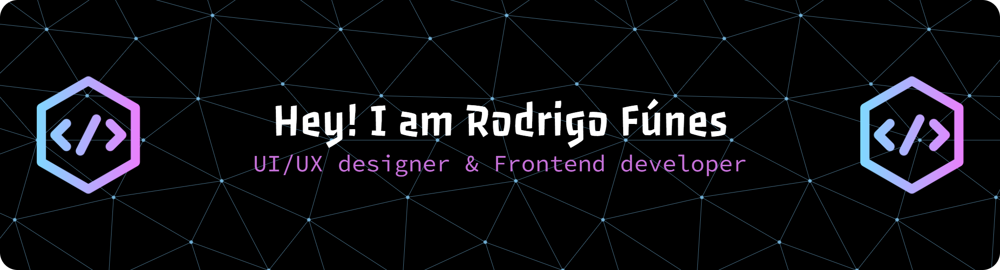

# 👋 Hola, soy Rodrigo  

💻 **Desarrollador Web Frontend** con pasión por crear interfaces modernas, rápidas y centradas en el usuario.  
Me enfoco en:  
- 🚀 Rendimiento (lazy loading, optimización de imágenes, code splitting)  
- 🎨 Diseño UI/UX intuitivo  
- ♻️ Código limpio y componentes reutilizables  

Mi meta: transformar ideas en productos digitales que aporten valor real y medible a los negocios.  

---

## 🚀 Frontend

  

## 🛠 Backend

  

## 🎨 UI/UX

  

## 🗄 Bases de Datos

  

## ⚙️ DevOps / Herramientas

  

---

## 📊 Stats

  
   
  

---

## 🌐 Conecta conmigo

  | <a href="https://portafolio-refe.vercel.app/">Portafolio</a>
  | <a href="https://www.linkedin.com/in/rodrigo-fúnes">LinkedIn</a>
  | <a href="mailto:rodrigofunes@hotmail.es">Email</a> |

